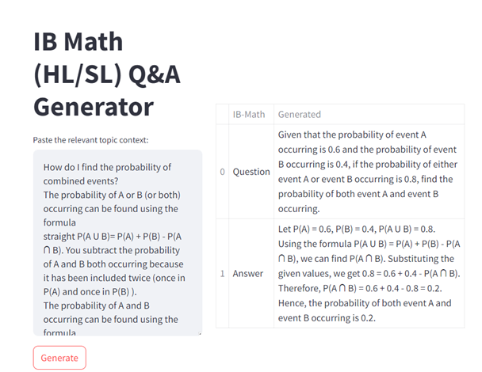

# IB Math Question and Answer Generator
## Mini Demo 
Given a relevant context the generator would generate an example question and answer.
With further fine-tuning, questions of desired level: HL/SL and type: calculator/non-calculator could be generated more accurately. 

 

More details could be found on IB_Math_QA_Generator_notes.pdf above in the repository. After clicking on IB_Math_QA_Generator_notes.pdf, click the download icon (Download raw file) to view the pdf file on your pdf viewer. 
